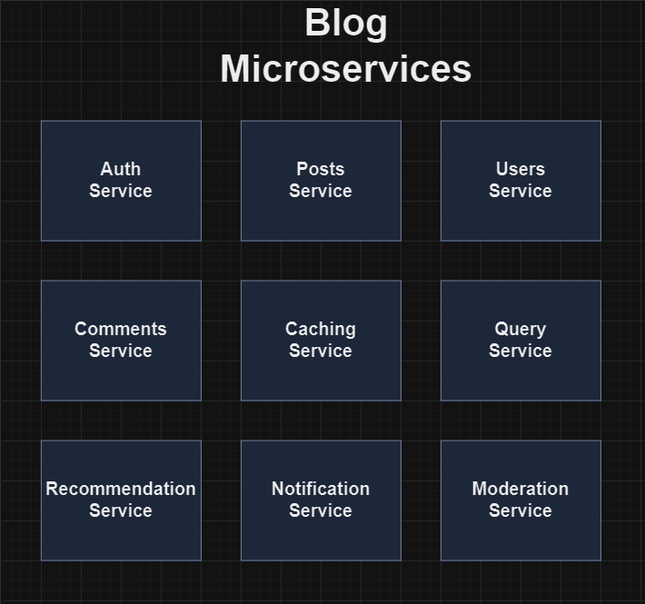
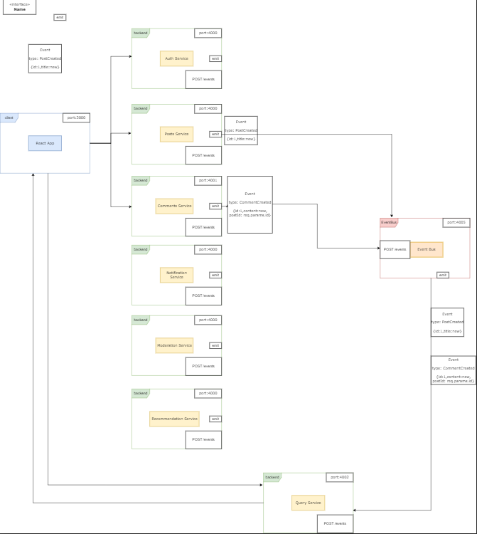

# React Blog App and MicroServices

This project (v1) will be a Full Stack MERN Application created using a micro services architecture.

The frontend will be a React App and other frontend libraries.

The backend will be using NodeJS, Express, MongoDB?, Redis and more.

Deployment will be using Docker and Kubernetes.

## Diagrams

###### Services

###### Data Flow

